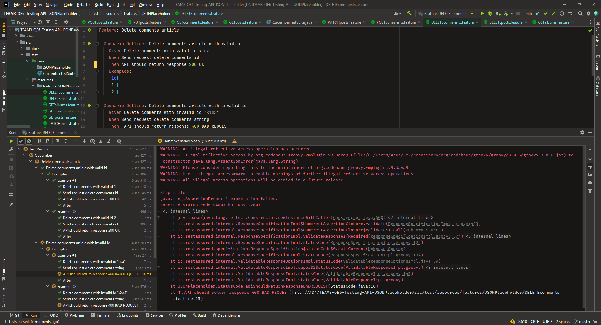
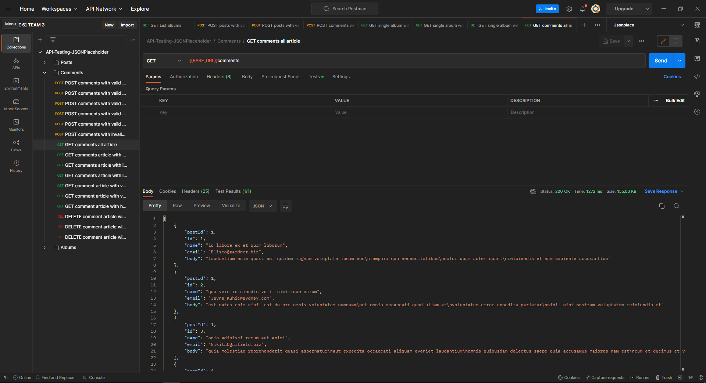

<div align="center">
  <a href="https://github.com/Luqmanhanung/Testing-API-JSONPlaceholder.git">
    
  </a>

  <p align="center">
    Group Project Program Immersive Alterra Academy
    <br />
    <a href="https://jsonplaceholder.typicode.com/"><strong>| Open API Documentation |</strong></a>
    <br />
    <br />
  </p>
</div>

## 📑 About the Project

<p align="justify">JSON Placeholder is a fake REST API that is primarily used for prototyping and testing. You can call it a web developer's image placeholder. JSON Placeholder is an online service that can be used when you need fake data to prototype or test some fake data. The code for JSON Placeholder can be run from anywhere under the support of JSONP and CORS. The primary use of JSON Placeholder is to fake a server, sharing the code, and many such REST API uses are associated with it.</p>

## 📓 Testing Documentation
[Test Case API](https://docs.google.com/spreadsheets/d/1zG0qoOOBBDK7TcXRiQ7FPckv4U22a6s-XICkMd6VKpw/edit?usp=sharing)

## 📝 Reports


#### Summary Report


#### Coverage Report


#### Test Documentation Snippet


#### Automation Testing When Run in Intellij IDE


#### Manual Testing When Run in Postman


## 🛠 Tools
**Manual:**


**Automation:**  


**Test Case Management:**


**Communication:**


## 🏎️ How to Run all Test Scenarios

1. Clone the repository
```bash
  $ git clone https://github.com/Luqmanhanung/Testing-API-JSONPlaceholder.git
```
2. Open  this Project Repository on Intellij IDE and Run this on the IDE terminal

```bash
  $ mvn clean verify
```


## 📱 Our teams

[](https://www.linkedin.com/in/luqman-hanung-asidiq/)
[](https://github.com/Luqmanhanung/)

[](https://www.linkedin.com/in/panji-eka-sukmana-3b478512b/)
[](https://github.com/panjiekasukmana)

[](https://www.linkedin.com/in/ilhamsyahrulsa/)
[](https://github.com/Ilhamsyhs)

<h5>
<p align="center">:copyright: 2022 | This Repository Built with :heart: from us</p>
</h5>